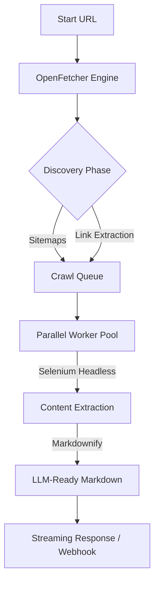

# 🚀 OpenFetcher

**OpenFetcher** is a high-performance, LLM-native crawling engine that transforms entire domains into high-fidelity, semantic Markdown with embedded visual context.

Engineered for the **RAG era**, it delivers lightning-fast, structured data streams optimized for **agentic workflows** and **massive-scale knowledge ingestion**.


---

## ✨ Features

- **Deep Semantic Crawling**  
  Recursively discovers and maps entire domain structures using intelligent sitemap parsing and link extraction.

- **LLM-Ready Markdown**  
  Converts complex HTML into clean, structured Markdown optimized for RAG context windows.

- **Visual Context Preservation**  
  Captures high-fidelity images and preserves their semantic relationship with surrounding text.

- **Real-Time Telemetry**  
  Provides per-page execution timing with live NDJSON streaming output.

- **Parallel Architecture**  
  Orchestrates concurrent headless browsers for rapid, large-scale extraction.

---

## 🏗️ Architecture



---

## 🚀 Getting Started

### 1️⃣ Prerequisites

- Python **3.10+**
- Google Chrome + Chromedriver
- **Recommended:** 8GB+ RAM for high-concurrency local runs

---

### 2️⃣ Local Installation

```bash
git clone https://github.com/PremChaurasiya07/OpenFetcher.git
cd OpenFetcher

python -m venv venv
source venv/bin/activate  # Windows: venv\Scripts\activate

pip install -r requirements.txt
```

---

### 3️⃣ Run Locally

```bash
uvicorn main:app --host 0.0.0.0 --port 3003
```

---

## ⚙️ Increasing Limits (Local Power Users)

Edit the following in `scraper_engine.py`:

| Constant | Render | Local |
|--------|--------|-------|
| MAX_CONCURRENT_BROWSERS | 1–5 | 10–15 |
| PAGE_LIMIT | 15 | 100–500 |
| time.sleep | 2.0s | 0.5–1.0s |

---

## 📡 API Usage

### Endpoint
POST `/scrape`

### Payload
```json
{
  "url": "https://supermemory.ai"
}
```

---

## 📄 License

MIT License.
